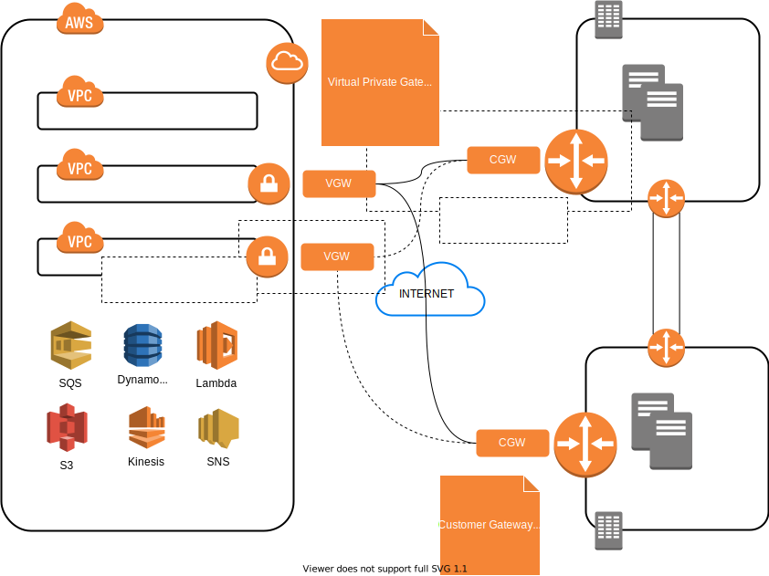

## AWS Managed VPN

| Flexibility                                | Cost                         | Resiliency                                        | Performance                      |
| ------------------------------------------ | ---------------------------- | ------------------------------------------------- | -------------------------------- |
| Easy setup (minutes)                       | 0.05 per VPN connection hour | Leverage both VGW endpoints (two tunnels per VPC) | Up to 1.25 Gbps (limited at VGW) |
| NAT-T, AES-256, SHA-2 and latest DH groups | Data Transfer                | Think about CGW redundancy (four tunnels per VPC) |                                  |
| Static (1 prefix) or BGP (<100 prefixes)   |                              |                                                   |                                  |
| Repeat for every VPC                       |                              |                                                   |                                  |

## Software VPN (Amazon EC2)

Allow you to use custom appliances like cicsco DMVPN or Sophos UTM suite, ... specific routing protocol or custom security feature that sits on top of the tunnel.

You can do it yourself by the obvious following steps

- Launch EC2 Instance
- Make sure to have a route to the IGW
- Make sure that the instance as an Elastic IP attached
- Install the VPN Software

or deploy a ready VPN software from AWS marketplace

| Flexibility                                      | Cost                   | Resiliency                                                   | Performance                                                  |
| ------------------------------------------------ | ---------------------- | ------------------------------------------------------------ | ------------------------------------------------------------ |
| Any open source or commercial vendor             | Vendor licensing       | VPC endpoint HA acieved by additional EC2 instances in second AZ | Defined by EC2 instance size and type                        |
| Opens up proprietary features set                | EC2 hourly cost        | Customer side HA is also recommended                         | Multi Gbps can be achieved per VPN instance (for all tunnels) |
| Customer responsible for HA and scaling          | High Availability cost |                                                              | Multiple instances for the same VPC are possible             |
| Advanced solutions can be build using automation | Data transfer          |                                                              |                                                              |

## Direct Connect

**Customer presence in the DX location**

Just need to specify if need 1 or 10 Gb connection and wait for the Letter of Authorization that allows you to connect to a specific port (cross connection between customer router and AWS device)

**Customer not present in the DX location**

Circuit between customer data center and DX location through partner network provider.
In this case the Letter of Authorization has to be given to the Network provider that requires the cross connection on customer behalf.
Also in this scenario you can request a network speed that is below 1 Gbps, in this case you can get only 1 Virtual Interface

**Customer not present in the DX location**

Service provider network extending to DX location. This is relevant if you are already engaged with a service provider that already gives you connectivity with different locations and you want to extend the connectivity to AWS (ex. MPLS networks). Generally providers have their own Direct Connect accounts and they connecto to your datacenter and your VPC on top of them.

Always ask following questions to your provider to understand what is the exact scenario you are falling in:

- AWS Account that owns the DX port
- Adding / Removing Virtual Interfaces
- Routing ownership
- End-to-end costs

Resiliency

- Think about using VPN as a backup solution (it is possible to punt in place policies that favor direct connect path over VPN)

- Think about getting two different Direct Connect ports to build fault tolerance at AWS side. At the same DX location or better at 2 different DX locations

- Think about HA to the corporate side 

  

| Flexibility                                     | Cost                            | Resiliency                       | Performance                                                  |
| ----------------------------------------------- | ------------------------------- | -------------------------------- | ------------------------------------------------------------ |
| 23+ AWS regions, 104+ POPs worldwide            | Port Hours                      | 2 x DX in two locations + VPN    | 1 or 10 Gbps ports (100Gbps available in some regions)       |
| LOA available in 72 hours (or less)             | Data out transfer               | 2 x DX in two separate locations | 100, 200, 300, 400, 500 Mbps ports available through partners |
| Lead time of circuit build-out could take weeks | Service provider circuit / MPLS | 2 x DX in one location           | LAG (Link Aggregator Group) several connections in a group for aggregate bandwidth |
|                                                 | Colo cage (if applicable)       | DX + VPN                         | ECMP across multiples                                        |
|                                                 |                                 | DX                               |                                                              |

**Virtual Private Gateway**

You can chose to terminate the connection at AWS side in a single AWS region via a Private Virtual Interface or to have access to the AWS Backbone via VPG

Use AWS Direct Connect gateway to connect your VPCs. You associate an AWS Direct Connect gateway with either of the following gateways:

- A transit gateway when you have multiple VPCs in the same Region
- A virtual private gateway

**Transit Gateway**

A transit gateway is a network transit hub that you can use to interconnect your virtual private clouds (VPCs) and on-premises networks.

# References

- [AWS re:Invent 2017: Extending Data Centers to the Cloud: Connectivity Options and Co (NET301)](https://www.youtube.com/watch?v=lN2RybC9Vbk)

