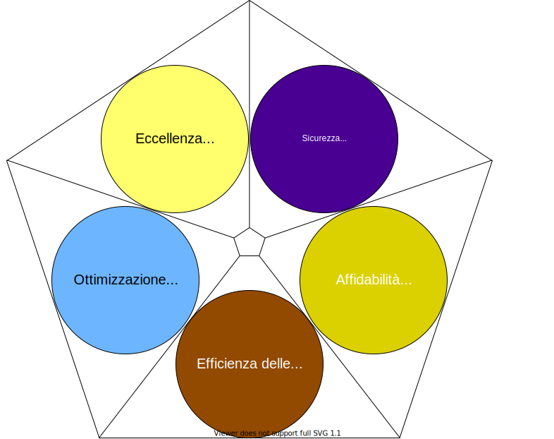
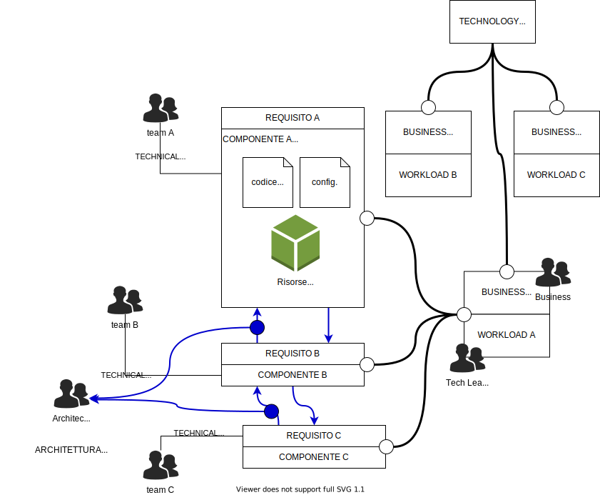
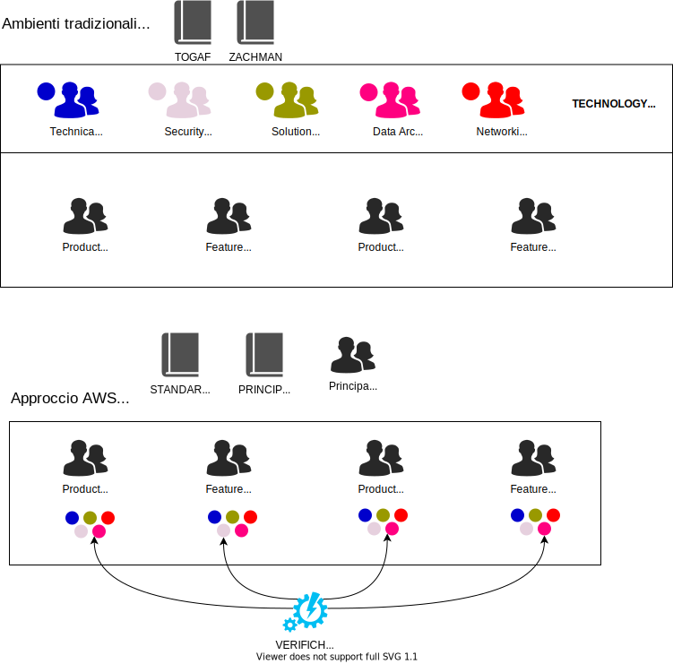

# AWS Framework di Architettura cloud

Non è un meccanismo di audit ma uno strumento per generare una conversazione costruttiva identificando le aree che non risultano ben allineate alle best practice di architettura nel cloud identificate da AWS.

| PILASTRO                                                     | OBIETTIVI                                                    |
| ------------------------------------------------------------ | ------------------------------------------------------------ |
|  Eccellenza Operativa *(DevOps in sostanza)* | - Supportare lo sviluppo - Eseguire carichi di lavoro in modo efficace - Visibilità dettagliata delle operazioni - Miglioramento continuo di processi e procedure di supporto |
|  Sicurezza | Proteggere dati, sistemi ed asset attraverso le tecnologie cloud |
|  Affidabilità | - Capacita di un carico di lavoro di funzionare come previsto quando previsto  - Possibilità di utilizzare e testare il carico di lavoro sempre durante il suo ciclo di vita |
|  Efficienza delle Prestazioni *(Monitoraggio / CloudWatch)* | - Soddisfacimento dei requisiti del sistema mediante lo sfruttamento efficiente delle risorse - Mantenimento dell'efficienza nelle fasi di adeguamento al carico e di evoluzione delle tecnologie |
|  Ottimizzazione dei Costi | Fornire valore al minor costo possibile                      |

## Definizioni

Rappresentazione degli elementi fondamentali secondo la terminologia utilizzata nel framework.

## Approccio all'Architettura

## Principi Generali

- **Stop guessing your capacity needs**: Sfruttare l'elasticità del cloud per eliminare la necessità di tirare ad indovinare relativamente al dimensionamento dei workload
- **Test systems at production scale**: Sfruttare la possibilità di creare rapidamente un ambiente identico a quello di produzione per effettuare i test solo per il tempo necessario ad eseguirli. Non serve sostenere il costo degli ambienti nei momenti in cui questi non sono necessari
- **Automate to make architectural experimentation easier**: Sfruttare la possibilità di automatizzare completamente la creazione e la gestione dei workload in modo da poter effettuare esperimenti evolutivi a basso costo e basso impatto
- **Allow for evolutionary architectures**: Approfittare della maggiore semplicità di evoluzione dell'architettura fornita dalle grandi possibilità di automazione e flessibilità del cloud per allineare frequentemente l'architettura alle mutevoli esigenze business
- **Drive architectures using data**: L'infrastruttura cloud è codice sorgente, questo permette di effettuare delle misure sulle evolutive per accertarne l'efficacia ed effettuare decisioni basate sui dati
- **Improve through game days**: Simulare eventi in produzione per individuare le aree che richiedono maggiore solidità ed accertarsi di essere pronti a reagire rapidamente quando necessario

## Toolbox

**Well Architected Tool**

Permette di eseguire gratuitamente una review di un workload mediante i questionari che sono parte del Framework. Fornisce quindi delle indicazioni in merito all'allineamento del workload al Framework.

**Well Architected Labs**

Repository di codice e documentazione per agevolare l'implementazione delle best practice.

## Link Utili

- [Home Page del Framework di Architettura AWS](https://aws.amazon.com/architecture/well-architected)
- [AWS Well Architected Tool](https://aws.amazon.com/well-architected-tool)
- [AWS Well Architected Labs](https://wellarchitectedlabs.com/)

