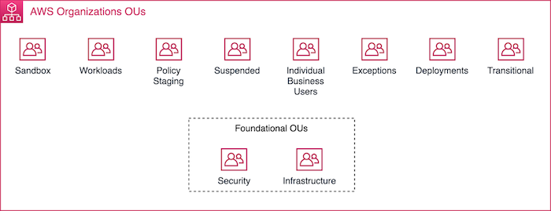

# Configurazioni Multi Account

AWS fornisce una serie di servizi che danno la possibilità di organizzare il proprio business utilizzando più di un singolo account. Alcune delle ragioni per le quali ha senso questo approccio sono le seguenti:

- Promuovere decentramento ed autonomia
- Confine di isolamento per Identity and Access Management (l'accesso alle risorse cross-account deve essere esplicimentamente permesso) 
- Eliminare dipendenze e conflitti dove non ha senso che ci sia dipendenza e necessità di coordinamento
- Confine entro il quale si applicano specifiche policy di compliance (Es. si può isolare i bucket S3 il cui contenuto deve essere pubblicamente raggiungibile in specifici account ed avere una policy più stringente altrove)
- Autonomia decisionale in termini business
- Si può governare centralmente ed allo stesso tempo dare autonomia alle varie business unit relativamente a temi che non è necessario siano centralmente governati
- L'acquisizione di una business unit è semplificata ed agevolata

## Preambolo - Alcuni modelli organizzativi comuni

**[FIGURA]** *Modelli organizzativi. COTS = Custom and commercial off-the-shelf; ITSM = IT Service Management*

Nel modello **Traditional Ops** il team responsabile dello sviluppo di una particolare applicazione non ha ulteriori responsabilità in termini di Infrastruttura ed Operations. 
Esiste un team che si occupa del provisioning infrastrutturale (<u>Cloud Platform Engineering</u>) ed un team che si occupa dei processi sia a livello infrastrutturale che applicativo.

Nel modello **CloudOps** non esiste uno specifico team che gistisce esclusivamente Operations. Quello che serve per il deploy in produzione degli applicativi è responsabilità del medesimo team che è owner dell'applicativo. Quello che serve in termini di Operations per il mantenimento dell'infrastruttura è invece responsabilità del team di <u>Cloud Platform Engineering</u>. 

Nel modello **DevOps** la centralizzazione in termini di di Infrastruttura / Operations in capo al team  di <u>Cloud Platform Engineering</u> è limitata solo agli aspetti che risultano streattamente cross (comuni per l'intera organizzazione). Chi ha ownership di un workload ha forte autonomia su temi infrastrutturali e di operations per ciò che concerne il proprio workload.

### Strumenti che AWS mette a disposizione

- **AWS Organizations** (privisioning centralizzato di account e risorse; applicazione di policy di sicurezza e compliance auditing; condivisione di risorse; controlle degli accessi ad account, region e servizi; ottimizzazione dei costi; semplificazione della fatturazione). Possibile elaborare 2 tipi di policy:
  - Authorization Policy: TODO - approfondimento
  - Management Policy: TODO - approfondimento

### AWS Organizations - Composizione di una Organizzazione

- **Un management account**. Viene effettuata in questo account l'amministrazione di OUs e policy; la creazione degli account membri e la loro associazione con le OUs. N.B. Avere accesso al management account non implica accesso a tutti gli account che fanno parte dll'organizzazione: devono essere configurati [Ruoli IAM](https://docs.aws.amazon.com/IAM/latest/UserGuide/id_roles.html) cross-account per autorizzare l'accesso.
- Un qualsiasi numero di **member account**
- Un qualsiasi numero di (**OUs**) . 
  - Ad una OU possono essere associate una o più policy. Le policy hanno poi effetto anche su tutta la gerarchia che deriva dal nodo (OU) al quale è associata (OUs ed account). 
  - Le OUs possono essere utilizzate per organizzare gerarchicamente e raggruppare account che condividono delle policy di sicurezza e necessità in termini di processi. La domanda chiave da porsi è: "Quanto è probabile che il gruppo abbia bisogno di un set di policy simile?"
  - Ad esempio è possibile applicare una policy SCP al nodo root dell'organizzazione che impedisce agli account membri di lasciare l'organizzazione.
  - Una OU può avere esclusivamente un parent ed ogni account può essere membro esclusivo di una OU
- Un qualsiasi numero di **policy**

**[FIGURA]** *Un esempio di Organizzazione*

**[FIGURA]** *OUs raccomandate da AWS*

**Utilizzo della federazione**

La raccomandazione di AWS è di sfruttare le possibilità d federazione dell'identità di AWS attraverso uno dei due approcci:

-  AWS Single Sign-on (AWS SSO)
- Integrazione di IAM con degli identity provider di terze parti

In questo modo si possono riutilizzare i processi preesistenti per il controllo degli accessi da parte degli utenti. Si evita in questo modo di dover creare ed amministrare le singole utenze in ogni account, gli utenti possono utilizzare le loro credenziali esistenti per accedere agli account per i quali sono stati autorizzati. Un altro beneficio è che si tengono fuori informazioni che permettono di identificare le persone (PII) al di fuori di IAM.

L'eccezione per la quale sarà comunque necessario censire utenze è rappresentata dalla necessità di integrare applicazioni di terze parti che non supportano l'utilizzo di ruoli IAM.

## OU Fondamentali Raccomandate

### Security

**[FIGURA]** *Security OU ed account che ne fanno parte secondo le raccomandazioni di AWS*

- **Log archive** (qui dovrebbero confluire i log raccolti in tutti gli altri account con lo scopo di effettuare verifiche di sicurezza e compliance: Cloud Trail, AWS Config, VPC Flow Logs)
- **Security tooling** (Tutti i servizi e gli applicativi che servono a governare gli aspetti di sicurezza centrali a tutta l'organizzazione)
- **Security read-only access** (Necessario solo se si preferisce utilizzare ruoli cross-account invece di una federazione diretta ([federated access](http://aws.amazon.com/identity/federation/)).
- **Security break-glass** (Da utilizzare raramente, solo in caso di emergenza. Lo scopo è abilitare, in caso di incidenti, il team di security ed operations ad un accesso temporaneo con permessi di scrittura elevati quando sistemi di accesso standard non sono disponibili o adeguati. Le attività effettuate operando con questo account vanno loggate in dettaglio). Al termine delle procedure risolutive dell'incidente l'accesso viene revocato. Tipicamente, i tool di supporto in questo account vengono creati  on-demand ed in maniera automatizzata. Vengono poi dismessi al termine.

### Infrastructure 

Casi d'uso comuni per questa OU includono il governo di risorse di rete come ad esempio connessioni [AWS Site-to-Site VPN](https://docs.aws.amazon.com/vpn/latest/s2svpn/VPC_VPN.html) , integrazioni [AWS Direct Connect](http://aws.amazon.com/directconnect/), confgurazioni [AWS Transit Gateway](http://aws.amazon.com/transit-gateway/), DNS, endpoint Amazon VPC e sottoreti o VPC condivise.

Tra gli scenari più sofisticati possono esserci VPC o sistemi di sicurezza di rete utilizzati per centralizzare il traffico internet in entrata ed in uscita, proxy e filtri.

**[FIGURA]** *Infrastructure OU ed account che ne fanno parte secondo le raccomandazioni di AWS*

## Altre OU Raccomandate

### Sandbox

Utile per effettuare degli esperimenti con i servizi di AWS utilizzabili secondo le policy previste dall'Organizzazione. Generalmente questo tipo di account non hanno visibilità sulla rete o sulle risorse non pubbliche dell'Organizzazione alla quale appartengono. Su questo account si possono utilizzare automazioni e policy che limitano il budget, l'utilizzo in orari non lavorativi ed effettuano reset periodici.

### Workloads

Un criterio comunemente adottato è la separazione degli account che ospitano gli ambienti di produzione da quelli che ospitano ambienti diversi da produzione.

Comunemente i Workload condividono dati e risorse con altri workload, nell'esempio che segue si può immaginare che il data-lake venga utilizzato dagli altri account nello stesso ambiente.

**[FIGURA]** *Workload OU ed account che ne fanno parte secondo le raccomandazioni di AWS*

### Policy Staging

Comunemente utilizzato per testare policy come SCPs, TAG policy, ruoli e policy IAM prima di applicarle agli account target. 

Si può poi effettuare il rollout delle nuove policy in maniera graduale, applicandole inizialmente ad un solo account per verificare ulteriormente la loro correttezza.

Per quanto riguarda il test delle policy strettamente relative a specifici Workload, questo genere di test viene effettuato sugli account di non-produzione dei Workload stessi e non in questa OU.

Nell'esempio in figura si ipotizza che al di sotto della OU di PolicyStaging venga replicata la gerarchia degli account dell'intera organizzazione e per ogni account ne venga creato uno di Test.

**[FIGURA]** *Policy Staging OU ed account che ne fanno parte secondo le raccomandazioni di AWS*

### Suspended

Comunemente utilizzato per parcheggiare account che devono essere sospesi temporaneamente o durante il periodo transitorio degli account che devono essere sospesi in maniera permanente. Si possono applicare delle policy che inibiscono l'accesso ai servizi contenuti (fatta esclusione per i team Security o Cloud Platform); Si possono sospendere automaticamente servizi in esecuzione per minimizzare i costi.

### Individual Business Users OU

Per necessità puntuali non classificabili come Workload. Un esempio può essere l'utilizzo di S3 per condividere file. Questo scenario non comprende i casi nei quali l'utente può accedere ad un'applicazione che fa parte di un Workload come ad esempio QuickSight a scopo di Business Intelligence. In quel caso non è necessario che l'utente business abbia accesso a livello di account ma si può semplicemente autorizzare il suo accesso a livello di applicazione.

### Exceptions OU

Questo tipo di organizzazione può coprire le casistiche nelle quali gli Account richiedono un set di policy diverso da quello applicato per il resto delle organizzazioni. Nel momento in cui ci si rende conto che le casistiche che si stanno coprendo sono comuni a più Account è meglio far ricadere la gestione con Organzzazioni di tipo Workload.

### Deployments OU

Non si applica se il tooling necessario per CI-CD è esterno ad AWS (on promise / altri servizi). 
Nel momento in cui invece si vuole sfruttare AWS per la toolchain, AWS raccomanda l'utilizzo di un set di Production Deployment OUs.
Alcuni dei razionali che scoraggiano la gestione del deployment all'interno delle unità organizzative relative ai Workload sono i seguenti:

- I sistemi responsabili del deploy in produzione degli artefatti; delle verifiche di qualità e compliance; della promozione degli artefatti, sono maggiormente critici rispetto a quelli relativi ai Workload. Utilizzando questo modello e se il deploy prevede un watch ed un pull degli artefatti gli account di produzione dei Workload non hanno bisogno di avere permessi di scrittura nei repository di artefatti ma è sufficiente che abbiano accesso in lettura.
- Le pipeline di CI-CD hanno necessità di accedere a workload sia di produzione che di non produzione. Centralizzando la gestione delle Pipeline si può evitare che i Workload di produzione abbiano accesso anche a quelli di non-produzione. 
-  Il tooling utilizzato per la gestione di CI-CD è diverso da quello necessario per l'operativtà dei Workoad. Segregando tali tool si riduce la superficie di attacco.

**[FIGURA]** *Raggruppamento diverso delle responsabilità di CI-CD*

Nel diagramma in figura si rappresenta uno scenario in cui Workload 1 è completamente isolato a livello di CI-CD ed ha la sua OU di Deployment di Produzione dedicata. Per i Workload 2,3,4 viene invece utilizzata la medesima Pipeline di produzione.

AWS scoraggia la centralizzazione della CI-CD in un singolo Account, la gestione della sicurezza è più difficile come è anche più difficile mitigare gli impatti cross di eventuali incidenti.

Da considerare che è necessario prevedere l'accesso da parte degli utenti owner dei Workload anche agli Account di Deploy, ad esempio:

- [Lettura] Monitoraggio dell'esecuzione della Pipeline
- [Scrittura] Il processo di promozione dell'artefatto potrebbe richiedere un certo livello di diritti di scrittura da parte di un subset degli Owner del Workload

Al pari di quanto avviene per il processo di evoluzione dei Workload, è importante prevedere degli account di non -produzione anche per le Pipeline. Le pipeline di non-produzione non dovrebbero avere accesso ad alcuna risorsa di produzione.

### Transitional OU

[ TODO ]

## Glossario

- business unit
- guardrails (regole per sicurezza, ops e compliance)

## Riferimenti

[AWS Whitepaper - Organizing Your AWS Environment Using Multiple Accounts](https://docs.aws.amazon.com/whitepapers/latest/organizing-your-aws-environment/organizing-your-aws-environment.html)